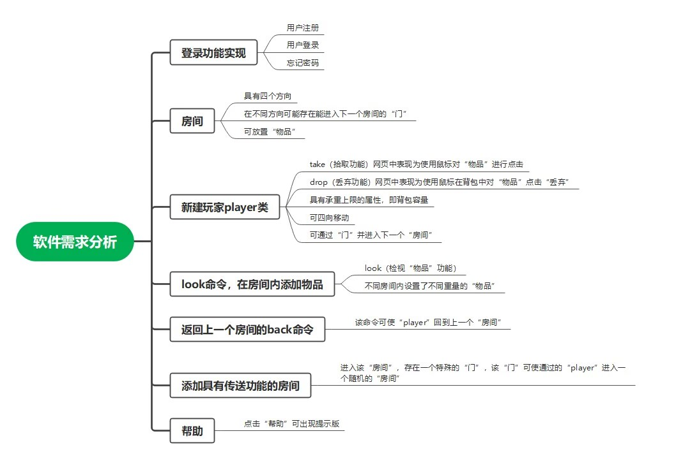
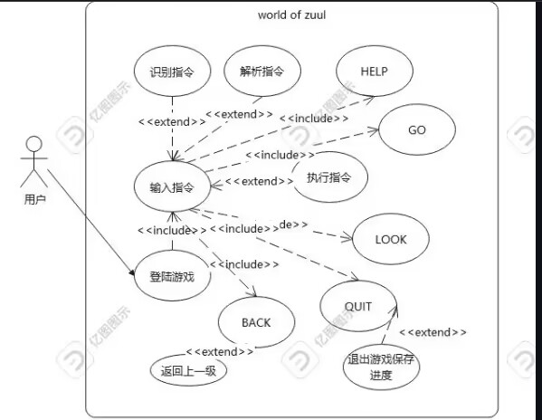
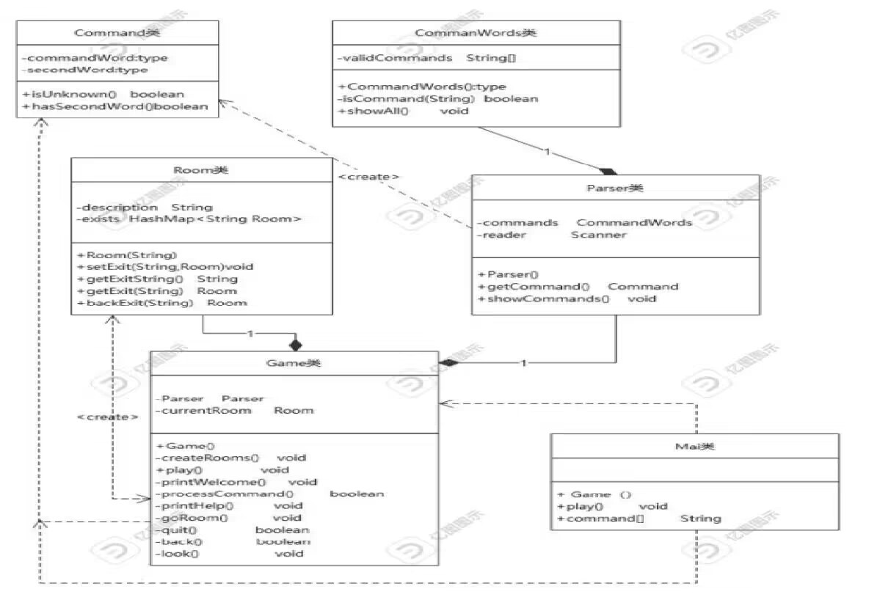
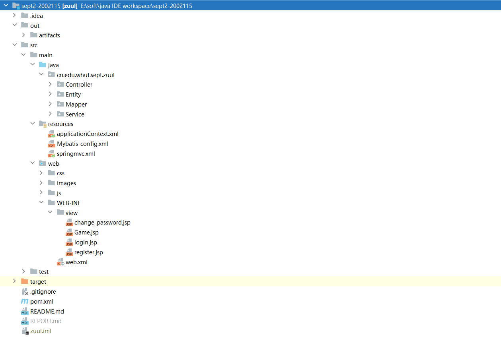
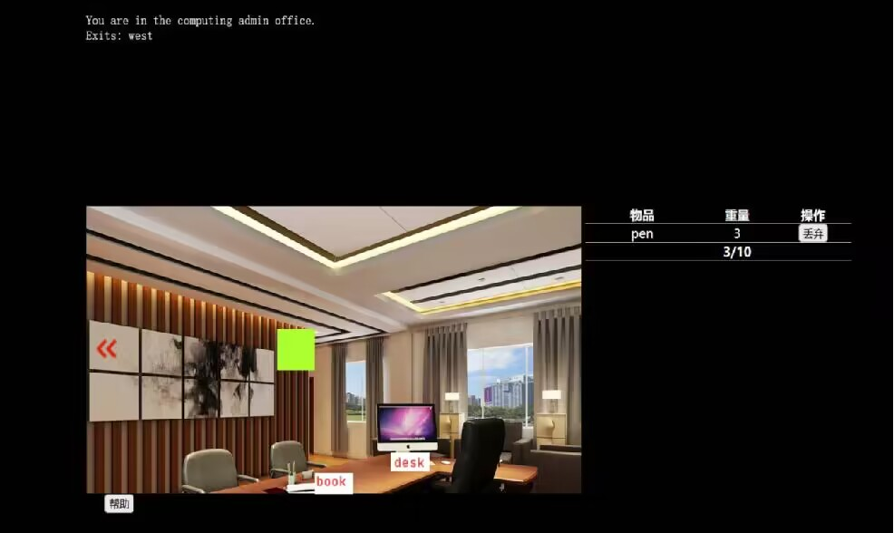
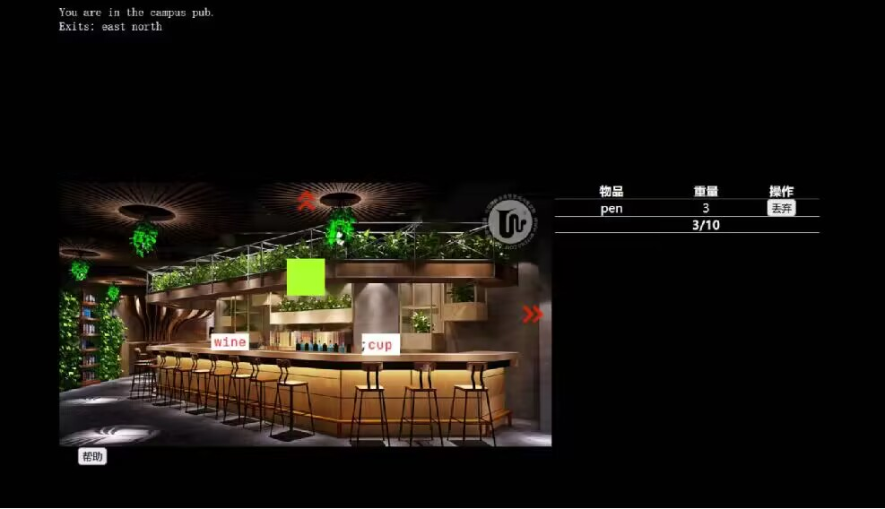
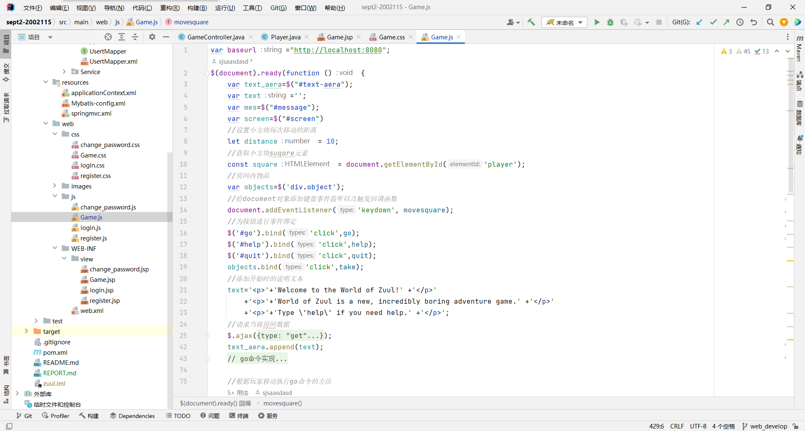
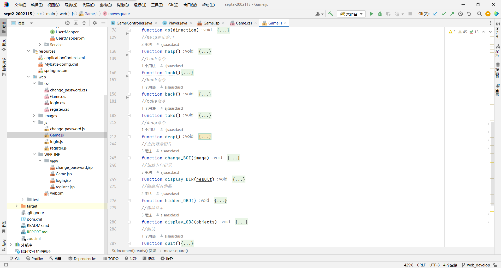
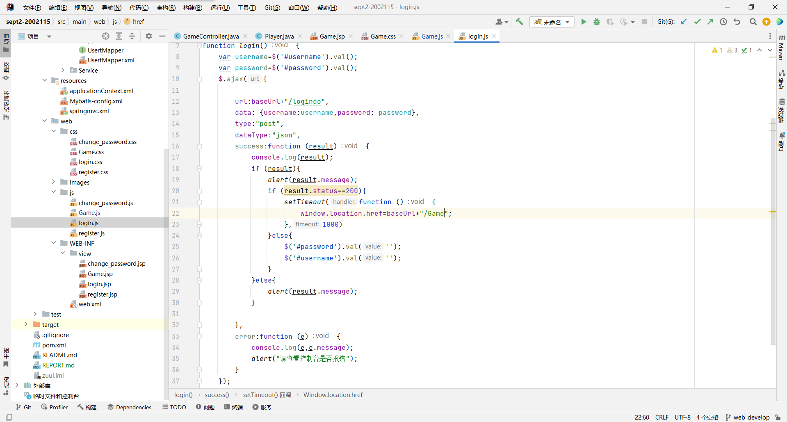
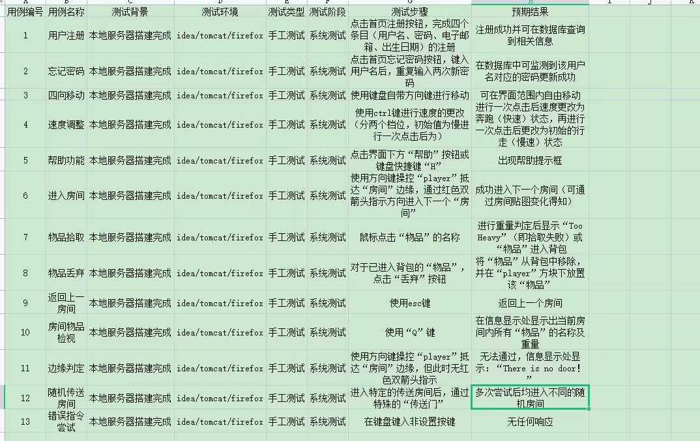

## 1.样例工程代码结构分析
### 1.1需求分析

### 1.2用例图

### 1.3类图

### 1.4程序代码整体结构

## 2.功能扩展介绍
### 2.1“look”命令
~~~java
    public String DoCommandLOOK(Game game) {

        return game.getCurrentPlayer().getCurrentRoom().getShortDescription()
                + "\n\nThings in this room:\n"
                + game.getCurrentPlayer().getCurrentRoom().getObjectsDescription()
                + "\n"
                + game.getCurrentPlayer().getCurrentRoom().getExitString();
    }
~~~
   ### 2.2“back”命令
 ~~~java  
    public void DoCommandBACK(Game game){
         Room saveRoom = game.getCurrentPlayer().getCurrentRoom();
        game.getCurrentPlayer().setCurrentRoom(game.getLastRoom());
        game.setLastRoom(saveRoom);
    }
~~~
### 2.3增加具有传输功能的房间
 ~~~java  
 private boolean transfer;   // 是否为传输房间
~~~
通过增加transfer变量来判断该房间是否为具有传输功能的房间
### 2.4 新建Player类
 ~~~java  
 public class Player {
    private final ArrayList<RoomObject> carryObjects; // 玩家随身携带的物品集合

    public int getMaxObjectWeight() {
        return maxObjectWeight;
    }

    private final int maxObjectWeight;  // 玩家随身携带物品重量的上限
    public Room currentRoom;

    public Player() {
    }

    public Room getCurrentRoom() { return currentRoom; }

    public void setCurrentRoom(Room currentRoom) {
        this.currentRoom = currentRoom;
    }

    public boolean takeObject(RoomObject roomObject) {
    }

    public boolean dropObject(RoomObject roomObject) {
    }

    public ArrayList<RoomObject> getCarryObjects() {
        return carryObjects;
    }

    public RoomObject getCarryObject(String name) {
    }
}
~~~
### 2.5 命令“take”和“drop”
 ~~~java  
  @Override
    public boolean DoCommandTAKE(Game game, RoomObject roomObject) {
        return game.getCurrentPlayer().takeObject(roomObject);
    }

    @Override
    public boolean DoCommandDROP(Game game, RoomObject roomObject) {
        return game.getCurrentPlayer().dropObject(roomObject);
    }
~~~
### 2.6 增加数据库功能
UserT类：
 ~~~java  
 public class UserT {
    private int id;
    private String username;
    private String password;
    private String email;
    @DateTimeFormat(pattern = "yyyy-MM-dd")
    private Date birthday;
    private float money;
    //private List<Article> articleList;
}
~~~
增加IUsertService类(接口)和UsertService类实现与数据库的连接
IUsertService类
 ~~~java  
public interface IUsertService {
    public  boolean userLogin(UserT user);
}
~~~
UsertService类
 ~~~java  
public class UsertService implements IUsertService{
    @Resource
    UsertMapper usertMapper;
    public boolean userLogin(UserT user) {
    }
    public boolean userRegister(UserT user) {
    }
    public boolean userChange_Password(UserT user){
        UserT input=usertMapper.getUserByName(user.getUsername());
        if(input!=null){
            try{
                input.setPassword(user.getPassword());
                usertMapper.updatePWD(input);
                return true;
            }catch (Exception e){
                e.printStackTrace();
                return false;
            }
        }else{
            return false;
        }
    }

    public boolean userpdchange(String username, String password) {
        UserT userT=usertMapper.getUserByName(username);
        if(userT!=null)
        {
            userT.setPassword(password);
            usertMapper.updatePWD(userT);
            return true;
        }
        else {
            return false;
        }
    }
}
~~~
## 3.图形化界面介绍

绿色方块代表游戏对象

当绿色方块移动到红色箭头即进入另一个房间并点击鼠标左键

将鼠标移动到房间左下角帮助点击鼠标左键可以查看游戏操作相关命令

可以通过键盘输入”Q“实现“look”命令查看当前房间的信息以及房间内的所有物品信息

通过键盘Esc键实现”back“返回上一个房间

将鼠标移动到房间内物品（如图中wine，cup）点击鼠标左键实现“take”拾取物品

游戏界面的右部中代表了角色拾取的物品信息，其中定义了背包的上限为10，当重量之和超过10时，即不可以拾取

鼠标移动到右部中的丢弃点击鼠标左键即可以实现“drop”丢弃该物品

## 4.前端代码以及与后端代码的整合
### 4.1 前端代码
#### 初始化界面

#### 前端命令和辅助方法

#### 登录方法

### 4.2 前后端代码接口
 ~~~java  
 public Object GO(String direction){
        String message;
        resultMap.put("direct",direction);
        if(CommandService.DoCommandGO(game,direction)){
            message=game.getCurrentPlayer().currentRoom.getLongDescription();
            resultMap.put("status",1);
            resultMap.put("discription",message);
            resultMap.put("name",game.getCurrentPlayer().currentRoom.getName());
            resultMap.put("east",0);
            resultMap.put("west",0);
            resultMap.put("south",0);
            resultMap.put("north",0);
            resultMap.put("objects_room",this.game.getCurrentPlayer().currentRoom.getRoomObjects());
            Set<String> keys = game.getCurrentPlayer().currentRoom.getExit().keySet();
            for(String exit : keys) {
                resultMap.replace(exit,1);
            }
            return resultMap;
        }else{
            message="There is no door!";
            resultMap.put("status",0);
            resultMap.put("discription",message);
            return resultMap;
        }

    }

~~~
命令TAKE ,BACK,DROP等如上述GO命令一样实现前后端的接口 
## 5.测试说明
